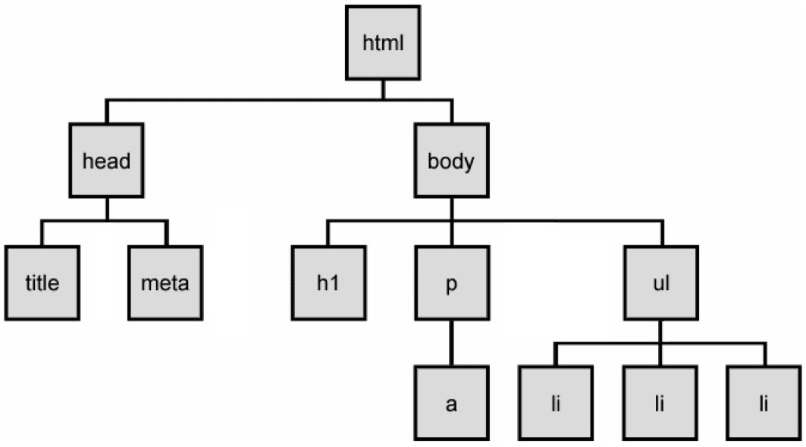
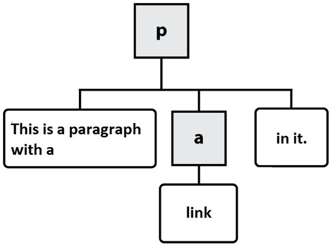
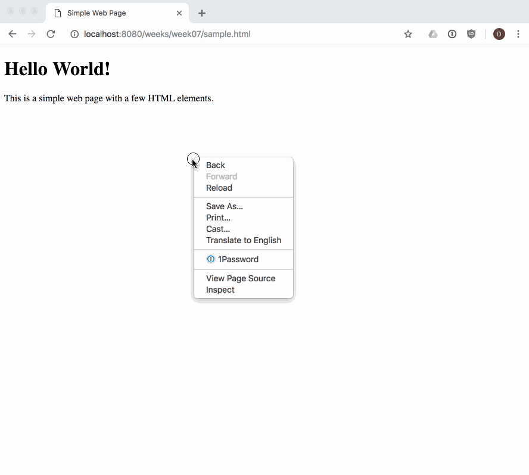
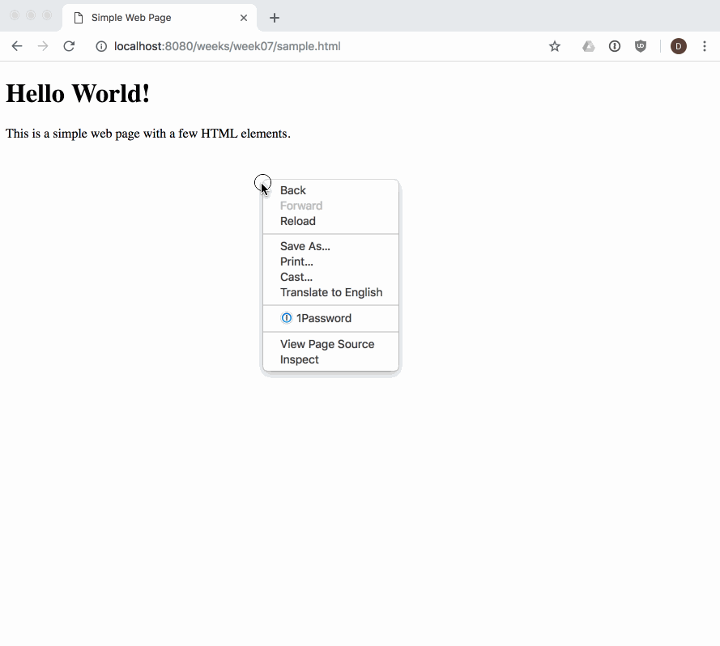
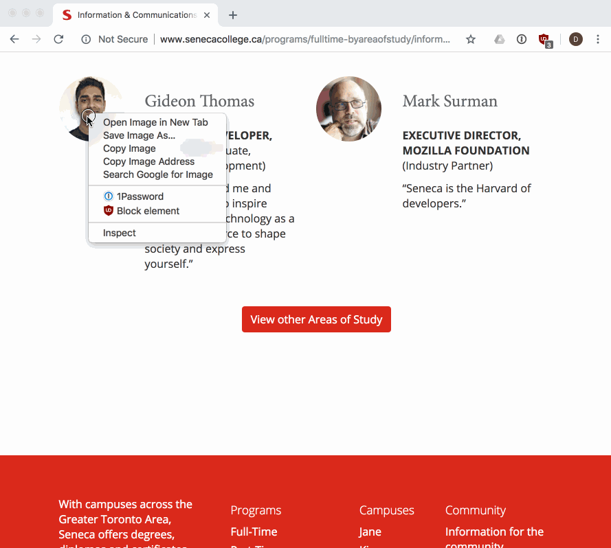
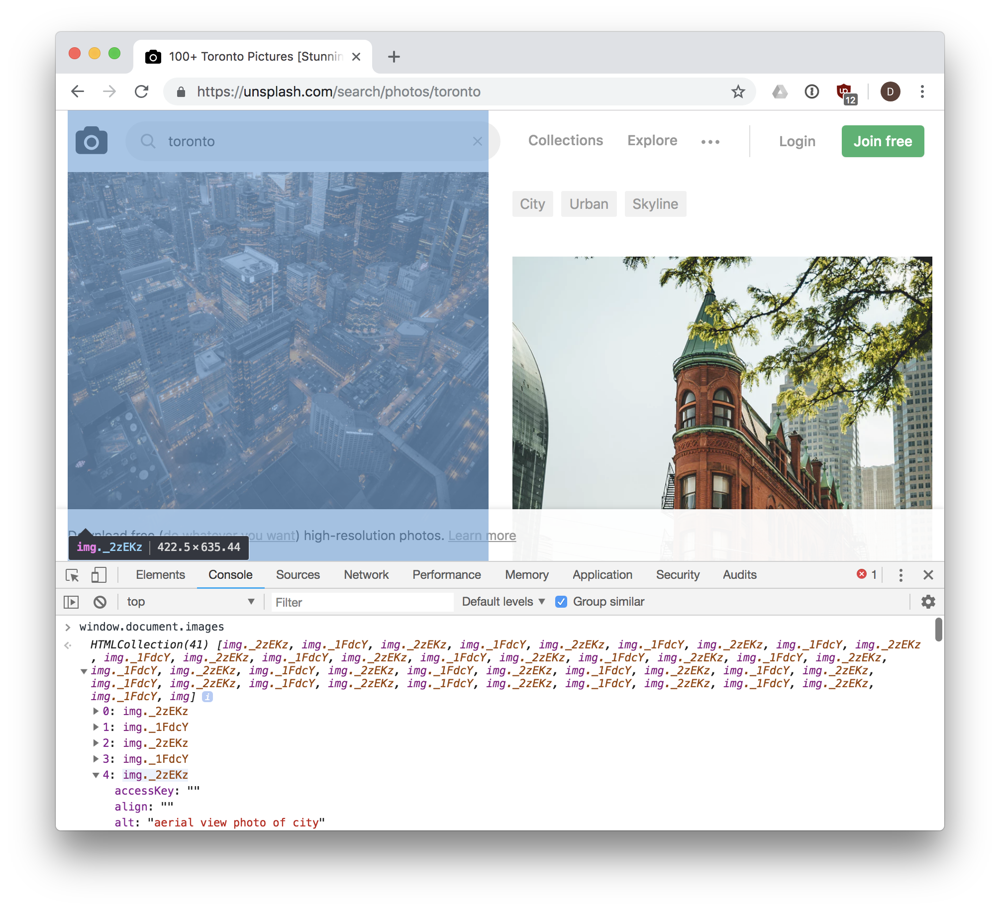

# WEB222 - Week 7

## Suggested Readings

* [HTML Tables (MDN)](https://developer.mozilla.org/en-US/docs/Learn/HTML/Tables)
* [Images in HTML (MDN)](https://developer.mozilla.org/en-US/docs/Learn/HTML/Multimedia_and_embedding/Images_in_HTML)
* [Video and Audio Content (MDN)](https://developer.mozilla.org/en-US/docs/Learn/HTML/Multimedia_and_embedding/Video_and_audio_content)
* [HTML Reference](https://developer.mozilla.org/en-US/docs/Web/HTML/Reference)

## From HTML to the DOM

Web pages rely on HTML for their initial structure and content.  We write web pages using HTML,
and then use web browsers to parse and render that HTML into a living (i.e., modifiable at runtime)
tree structure.  Consider the following HTML web page:

The DOM Tree is a living version of our HTML.

```html
<!DOCTYPE html>
<html>
    <head>
        <title>This is a Document!</title>
        <meta charset="UTF-8">
    </head>
    <body>
        <h1>Welcome!</h1>
        <p>This is a paragraph with a <a href="index.html">link</a> in it.</p>
        <ul>
            <li>first item</li>
            <li>second item</li>
            <li>third item</li>
        </ul>
    </body>
</html>
```

The browser will parse and render this into a tree of nodes, the [DOM Tree](https://en.wikipedia.org/wiki/Document_Object_Model):



The DOM Tree is made up of DOM Nodes, which represent all aspects of our document,
from elements to attributes and comments.  We'll refer to nodes and elements interchangeably,
because all elements are nodes in the tree.  However, there are also other types of nodes,
for example: text nodes (the text in a block element) and attribute nodes (key/value pairs).
We don't always show every node in our diagrams.  Consider the `<p>` element from the example
above:

```html
<p>This is a paragraph with a <a href="index.html">link</a> in it.</p>
```

Here are the nodes that would be created:



In this diagram, the gray boxes represent element nodes, while the white boxes are text nodes.

When we load a web page in a web browser, we see its fully parsed and rendered form.
The web browser *begins* with the initial content we provide in our HTML.  We can see the
initial source HTML for any page we visit, whether we authored it or not:



Our DOM Tree gets its name because of its shape: a *root* element connected to *child* nodes that extend
like the branches of a tree.  This tree structure is how the browser views our web page,
and is why it is so important for us to open and close our HTML tags in order (i.e., our tags
define the structure of the tree that the browser will create at runtime).

As web developers we can see and interact with the DOM tree for a page using the browser's
built-in developer tools:



The dev tools allow us to [view and work with](https://developers.google.com/web/tools/chrome-devtools/beginners/html)
the parsed DOM elements in a page.  We can also use the dev tools to visually select
an element in the page, and find its associated DOM element:



> NOTE: it's a good idea to get experience using, and learn about your browser's dev tools so that you can debug and understand when things go wrong while you are doing web development.  There are a number of guides to help you learn, like [this one from Google](https://developers.google.com/web/tools/chrome-devtools/).

## Programming the DOM

Web pages are dynamic: they can change in response to user actions, different data,
JavaScript code, etc.  Where HTML defines the initial structure and content of a page,
the DOM is the *current* or *actual* content of the page as it exists right now in your browser.
And this can mean something quite different from the initial HTML used to load the page.

Consider a web page like GMail (or another email web client).  When you visit your Inbox, the
messages you see are not the same as when your friend visits hers.  The HTML for GMail is the same
no matter who loads the page.  But it quickly changes in response to the needs of the current user.

So how does one modify a web page after it's been rendered in the browser?  The answer is DOM programming.
We've been using this "DOM" acronym without defining it, and its high time we did.

The [Document Object Model (DOM)](https://developer.mozilla.org/en-US/docs/Web/API/Document_Object_Model/Introduction) is a programming interface (i.e., set of Objects, functions, properties) allowing scripts to interact with, and modify documents (HTML, XML).  The DOM is an object-oriented representation of a web page.  Client-side web programming is essentially *using* the DOM via JavaScript to make web pages *do* things or *respond* to actions (e.g., user actions).

You may have noticed in our work with JavaScript that there was nothing particularly "webby" about
it as a language: we wrote functions, worked with arrays, created objects.  Lots of programming
languages let you do this.  JavaScript can't do anything with the web on its own.  Instead, we need
to access and use the Objects, functions, and properties made available to us by the DOM using JavaScript.

As web programmers we use the DOM via JavaScript to accomplish a number of important tasks:

1. Finding and getting references to elements in the page
1. Inspecting and modifying elements and their content
1. Creating, adding, and removing elements from the DOM tree
1. Run code in response to events triggered by the user, browser, or other parts of our code

Let's look at each one in turn.

[`window`](https://developer.mozilla.org/en-US/docs/Web/API/Window)

[`window.document`](https://developer.mozilla.org/en-US/docs/Web/API/Document)

### Finding elements in the DOM with JavaScript

Our entry point to the DOM from JavaScript is via the global variable `window`.  Every
web page runs in an environment created by the browser, and that environment includes
a global variable named [`window`](https://developer.mozilla.org/en-US/docs/Glossary/Global_object#window_object_in_the_Browser),
which is provided by the browser (i.e., we don't create it).

There are hundreds of Objects, methods, and properties available to our JavaScript code
via `window`.  One example is `document`, which is how we access the DOM in our code:

```js
// Access the document object for our web page, which is in the current window
var document = window.document;
```

Our document's tree of elements are now accessible to us, and we can access a number of 
well-known elements by name, for example:

```js
// Get the value of the document's <title>
var title = document.title;

// Return a reference to the document's <body> element
var body = document.body;

// Return a list of all <a> elements in the document
var hyperlinks = document.anchors;

// Return a list of all the  elements in the document
var images = document.images;
```

There are lots more.  We can easily experiment with these in the dev tools web console,
where we can access our `window` object.  For example, here is the web page
[https://unsplash.com/search/photos/toronto](https://unsplash.com/search/photos/toronto) with the
web console open, and the result of `window.document.images` is shown, 41 `` elements
are returned in a collection:



We can also use a number of methods to search for and get a reference to one or more
elements in our document: 

* [`document.getElementById(id)`](https://developer.mozilla.org/en-US/docs/Web/API/Document/getElementById) - returns an element whose `id` attribute/property has the given `id` `String`
    ```html
    <div id="menu">...</div>
    <script>
        var menuDiv = document.getElementById('menu');
    </script>
    ```
* [`document.querySelector(selectors)`](https://developer.mozilla.org/en-US/docs/Web/API/Document/querySelector) - similar to `document.getElementById(id)`, but also allows querying the DOM using [CSS selectors](https://developer.mozilla.org/en-US/docs/Web/CSS/CSS_Selectors) for an element that doesn't have a unique id:
    ```html
    <div id="menu">
        <p class="formatted">...</p>
    </div>
    <script>
        // We can specify we want to query by ID using a leading #
        var menuDiv = document.querySelector('#menu');
        // We can specify we want to query by CLASS name using a leading .
        var para = document.querySelector('.formatted');
    </script>
    ```
* [`document.querySelectorAll(selectors)`](https://developer.mozilla.org/en-US/docs/Web/API/Document/querySelectorAll) - similar to `document.querySelector(selectors`, but returns *all* elements that match the selectors as a [`NodeList`](https://developer.mozilla.org/en-US/docs/Web/API/NodeList):
    ```js
    // Get all <p> elements in the document as a list
    var pElements = document.querySelectorAll('p');
    // Loop through all returned <p> elements in our list
    pElements.forEach(function(p) { 
        // p is one of the returned <p> elements
    });
    ```

These four methods will work in any situation where you need to get a reference to
something in document.  In fact, you could rely solely on `document.querySelector()` and 
`document.querySelectorAll()`, which cover the same functionality as a number of other
DOM methods:

```js
// The following two lines of code do exactly the same thing.
// NOTE the use of # to indicate `demo` is an id in the second example.
var elem = document.getElementById('demo');
var elem = document.querySelector('#demo');
```

### Inspecting, Modifying a DOM element with JavaScript

Properties

element.className
element.id
element.innerHTML
element.parentNode
element.nextSibling
...


Methods

element.querySelector()
element.querySelectorAll()

element.removeChild(node) - removes the `node` from the `element`'s child list
element.appendChild(node) - places `node` at the end of the `element`'s child list
element.insertBefore(new, old) - places the `new` node in the `element`'s child list just before `old` child

element.hasAttribute(name) - checks if the attribute `name` exists on this `element`
element.getAttribute(name) - gets the value of the attribute `name` on this `element`
element.setAttribute(name, value) - sets the `value` of the attribute `name` on this `element`
element.removeAttribute(name) - removes the attribute `name` from this `element`

```html
<!-- The `hidden` attribute means this <div> won't be displayed until it's removed -->
<div id="error-message" hidden>
    <p>There was an error saving the document.  Please try again!</p>
</div>
<script>
    // Try to save the file, and 
    var error = saveFile(); 
    if(error) {
        var elem = document.querySelector('#error-message');
        elem.removeAttribute('hidden');
    }
</script>
```

```js
// Insert the user's picture (e.g., in response to hovering over a username)
var profilePic = document.createElement('img');

// Set attributes via getters/setters on the element vs. attributes
profilePic.id = 'user-' + username;
profilePic.height = 50;
profilePic.src = './images/' + username + '-user-profile.jpg';

// Insert the profile pic  into the document
document.body.appendChild(profilePic);
```

```js
// Use .innerHTML as a getter and setter to update some text
var elem = document.querySelector('#text');

elem.innerHTML = '<p>This is a paragraph</p>';
elem.innerHTML = elem.innerHTML + '<p>This is another paragraph</p>';
```

### Creating elements and Modifying the DOM with JavaScript

document.createElement(name)
document.createTextNode()
document.createAttribute()
document.createComment()
parentNode.appendChild(node)
parentNode.removeChild(node)


```js
// Create a new <h2> element
var newHeading = document.createElement('h2');

// Add some text to the <h2> element we just created.
// Similar to doing <h2>This is a heading</h2>.
var textNode = document.createTextNode('This is a heading');
// Add the textNode to the heading's child list
newHeading.appendChild(textNode);

// Insert our heading into the document, at the end of <body>
document.body.appendChild(newHeading);
```


```html
<div id="demo"></div>
<script>
    // Create a <p> element
    var pElem = document.createElement('p');

    // Use .innerHTML to create text nodes inside our <p>...</p>
    pElem.innerHTML = 'This is a paragraph.';

    // Get a reference to our <div> with id = demo
    var demoDiv = document.querySelector('#demo');

    // Append our <p> element to the <div>
    demoDiv.appendChild(pElem);
</script>
```


### Events

The DOM relies heavily on a concept known as [event-driven programming](https://en.wikipedia.org/wiki/Event-driven_programming).  In event-driven programs,
a main loop (aka the event loop), listens for, and processes events as they occur.
Examples of events include things like user actions (clicking a button, moving the mouse,
pressing a key, changing tabs in the browser), or browser or code initiated actions (timers,
messages from background processes, reports from sensors).

Instead of writing a program in a strict order, we write functions that should be called
in response to various events occurring.  Such functions are often referred to as
*event handlers*, because they handle the case of some event happening.  If there is no
event handler for a given event, when it occurs the browser will simply ignore it.  However,
if one or more event handlers are registered to listen for this event, the browser will
call each event handler's function in turn.

DOM programming is typically done by writing many functions that will happen in response
to events in the browser.  We register our event handlers to indicate that we want a particular
action to occur.  DOM events have a `name` we use to refer to them in code.

We can register a DOM event handler for a given event in one of two ways: 

1. `element.onevent`
1. `element.addEventListener('event', function(e) {...})`

In both cases above, we need an HTML element.  Elements in the DOM can trigger one or more
events, and we must know the name of the event we want to handle.  In the first method above,
a single event handler is registered.  In the second, we can add as many individual event
handlers as we wish.

Here's an example of the first method, where we only need a single event handler.
In the following case, a web page has a Save button, and we want to save the user's
work when she clicks it.

```html
<button id='btn-save'>Save</button>
<script>
    // Get a reference to our Save <button>
    var saveBtn = document.querySelector('#btn-save');

    // Register a single event handler on the save button's click event
    saveBtn.onclick = function(e) {
        // Save the user's work, calling a save() function we wrote elsewhere
        save();
    };
</script>
```

Now consider the same code, but with multiple event handlers.  In this case
we not only want to save the user's work, but also log the information in our
web analytics so we can keep track of how popular this feature is (how many times
it gets clicked):

```html
<span id="needs-saving">Document has changes, Remember to Save!</span>
...
<button id='btn-save'>Save</button>
<script>
    // Get a reference to our Save <button>
    var saveBtn = document.querySelector('#btn-save');

    // Register first event handler on the save button's click event
    saveBtn.addEventListener('click', function(e) {
        // Save the user's work, calling a save() function we wrote elsewhere
        save();

        // Remove the "needs to be saved" info showing in our UI, since we've saved
        document.querySelector('#btn-save').setAttribute('hidden', true);
    });

    // Register second event handler on the save button's click event
    saveBtn.addEventListener('click', function(e) {
        // Log some info to the console for debugging.
        console.log('[DEBUG] Save clicked');

        // Use an analytics Object (defined elsewhere) to update our count for this event
        analytics.increment('save');
    });
</script>
```

In this second example, it's possible for the browser to call more than one function
(event handler) in response to a single event (`click`).  What's nice about this is that
different parts of our code don't have to be combined into a single function.  Instead,
we can keep things separate (saving logic vs. analytics logic).


`window.onload`
`window.onbeforeunload` - just before the window is about to be unloaded

`onfocus` - when the element receives focus (cursor input)
`onblur` - when the element loses focus
`element.onclick` - when the user single clicks on an element
`element.ondblclick` - when the user double clicks on an element
`element.onchange` - when the content of an element changes (e.g., an input element in a form)
`onmouseout` - when the user moves the mouse outside the element
`onmouseover` - when the user moves the mouse over top of the element
`onresize` - when the element is resized


* `setTimeout(function, delayMS)` - schedule a task (`function`) to be run in the future (`delayMS` milliseconds from now).  Can be cancelled with `clearTimeout(timerID)`
* `setInterval(function, delayMS)` - schedule a task (`function`) to be run in the future every `delayMS` milliseconds from now.  Function will be called repeatedly.  Can be cancelled with `clearInterval(timerID)`

```html
<p>The current date and time is <time id="current-date"></time></p>
<script>
    setInterval(function() {
        var currentDate = document.querySelector('#current-date');
        var now = new Date();
        currentDate.innerHTML = now.toLocaleString();
    }, 1000);
</script>
```


[`Node`](https://developer.mozilla.org/en-US/docs/Web/API/Node)
[`NodeList`](https://developer.mozilla.org/en-US/docs/Web/API/NodeList) - an array of elements


## DOM Programming Exercise

In this exercise, we will practice working with HTML, images, URLs, the DOM,
events, and JavaScript to create an interactive web page.

1. Create a **folder** called `cats` on your computer
1. Create a **file** inside the `cats` folder named `index.html`
1. Open a **terminal** to your `cats` folder (i.e., `cd cats`)
1. In your **terminal**, start a web server by running the following command: `npx http-server`
1. Open the `cats` folder in Visual Studio Code
1. Edit the `index.html` file so it contains a [basic HTML5 web page](https://web222.ca/weeks/week05/#basic-html5-document), including a `<head>`, `<body>`, etc.  Try to do it from memory first, then look up what you've missed.
1. Save `index.html` and try loading it in your browser by visiting your local web server at `http://localhost:8080/index.html`
1. In your editor, modify the `body` of your `index.html` file to contain the text of the poem in [cats.txt](cats.txt).  Use HTML tags to markup the poem for the web.  Your page should have a proper heading for the title, each line should break at the correct position, and the poet's name should be bold.
1. Add an image of a cat to the page below the text.  You can use [https://upload.wikimedia.org/wikipedia/commons/c/c1/Six_weeks_old_cat_%28aka%29.jpg](https://upload.wikimedia.org/wikipedia/commons/c/c1/Six_weeks_old_cat_%28aka%29.jpg).
1. Adjust the `width` of your image so it fits nicely on your page.  What happens if you adjust the `width` and `height`?  
1. Create a new file in your `cats` folder called `script.js`.  Add the following line of JavaScript:
    ```js
    console.log('cats!');
    ```
1. Add a `script` element to the bottom of your `body` (i.e., right before the closing `</body>` tag).  Set its `src` to a file called `script.js`:
    ```html
        <script src="script.js"></script>
    </body>
    ```
1. Refresh your web page in the browser, and open your browser's `Dev Tools`, and `Web Console`.  Make sure you can see the `cats!` message printed in the log.
1. Try changing `cats!` in `script.js` to some other message, save your `script.js` file, and refresh your browser.  Make sure your console updates with the new message. 
1. Modify `index.html` and update your `` tag: add an attribute `id="cat-picture"` and remove the `src="..."`:
    ```html
    <!-- NOTE: there is no longer a src attribute in our HTML, we'll do it JavaScript below -->
    
    ```
1. Modify your `script.js` file to add the following code:

    ```js
    window.onload = function() {
        var img = document.getElementById('cat-picture');
        img.src = 'https://upload.wikimedia.org/wikipedia/commons/c/c1/Six_weeks_old_cat_%28aka%29.jpg';
    };
    ```
1. Save your `script.js` file and reload your browser.  Do you still see a cat?  If not, check your web console for any errors.
1. Modify your `script.js` and change your cat URL used by `img.src` to use [https://cataas.com/cat](https://cataas.com/cat).  The [cataas.com](https://cataas.com/#/) site provides cat pictures as a service via URL parameters.  Save `script.js` and reload your page a few times.  Do you see a different cat each time?
1. Modify your `script.js` file to move your image code to a separate function.  Make sure it still works the same way when you're done (save and test in your browser):

    ```js
    function loadCatPicture() {
        var img = document.getElementById('cat-picture');
        img.src = 'https://cataas.com/cat';
    }

    window.onload = loadCatPicture;
    ```
1. Rewrite `script.js` to update the picture after 5 seconds:

    ```js
    function loadCatPicture() {
        var img = document.getElementById('cat-picture');
        img.src = 'https://cataas.com/cat';
    }

    window.onload = function() {
        loadCatPicture();

        // Call the loadCatPicture function again in 5000ms
        setTimeout(loadCatPicture, 5 * 1000 /* 5s = 5000ms */);
    };
    ```
1. Rewrite `script.js` to update the picture every 15 seconds, forever:

    ```js
    function loadCatPicture() {
        var img = document.getElementById('cat-picture');
        img.src = 'https://cataas.com/cat';
    }

    window.onload = function() {
        loadCatPicture();

        // Call the loadCatPicture function every 15000ms
        setInterval(loadCatPicture, 15 * 1000 /* 15s = 15000ms */);
    };
    ```
1. Rewrite `script.js` to update the picture only when the user clicks somewhere in the window:

    ```js
    function loadCatPicture() {
        var img = document.getElementById('cat-picture');
        img.src = 'https://cataas.com/cat';
    }

    window.onload = function() {
        loadCatPicture();

        // Call the loadCatPicture function when the user clicks in the window
        window.onclick = loadCatPicture;
    };
    ```
1. Modify `index.html` and put a `<div>...</div>` around all the text of the poem.  Give your `div` an `id="poem-text"` attribute:
    ```html
    <div id="poem-text">
        <p>Cats sleep anywhere, any table, any chair....</p>
        ...
    </div>
    ````
1. Rewrite `script.js` to load the picture only when the user clicks on the text of the poem:

    ```js
    function loadCatPicture() {
        var img = document.getElementById('cat-picture');
        img.src = 'https://cataas.com/cat';
    }

    var poemText = document.getElementById('poem-text');
    poemText.onclick = loadCatPicture;
    ```
1. Rewrite `script.js` to also load the picture only when the user presses a key on the keyboard:

    ```js
    function loadCatPicture() {
        var img = document.getElementById('cat-picture');
        img.src = 'https://cataas.com/cat';
    }

    var poemText = document.getElementById('poem-text');
    poemText.onclick = loadCatPicture;

    window.onkeypress = function(event) {
        var keyName = event.key;
        console.log('Key Press event', keyName);
        loadCatPicture();
    };
    ```
1. Rewrite `script.js` to also load the picture only when the user presses a key on the keyboard, but only one of `b, m, s, n, p, x`:

    ```js
    function loadCatPicture() {
        var img = document.getElementById('cat-picture');
        img.src = 'https://cataas.com/cat';
    }

    var poemText = document.getElementById('poem-text');
    poemText.onclick = loadCatPicture;

    window.onkeypress = function(event) {
        var keyName = event.key;
        console.log('Key Press event', keyName);

        switch(keyName) { 
            case 'b':
            case 'm':
            case 's':
            case 'n':
            case 'p':
            case 'x':
                loadCatPicture();
                break;
            default:
                console.log('Ignoring key press event');
        }
    };
    ```
1. Rewrite `script.js` to also load the picture only when the user presses a key on the keyboard, but only one of `b, m, s, n, p, x`, and load the picture with one of the supported [cataas filters](https://cataas.com/#/):

    ```js
    function loadCatPicture(filter) {
        var url = 'https://cataas.com/cat';
        var img = document.getElementById('cat-picture');

        // If the function is called with a filter argument, add that to URL
        if (filter) {
            console.log('Using cat picture filter', filter);
            url += '?filter=' + filter
        }

        img.src = url;
    }

    var poemText = document.getElementById('poem-text');
    poemText.onclick = function() {
        loadCatPicture();
    };

    window.onkeypress = function(event) {
        var keyName = event.key;
        console.log('Key Press event', keyName);

        switch(keyName) { 
            case 'b':
                return loadCatPicture('blur');
            case 'm':
                return loadCatPicture('mono');
            case 's':
                return loadCatPicture('sepia');
            case 'n':
                return loadCatPicture('negative');
            case 'p':
                return loadCatPicture('paint');
            case 'x':
                return loadCatPicture('pixel');
            default:
                console.log('Ignoring key press event');
        }
    };
    ```
1. Rewrite `script.js` so that we only load a new cat picture when the old picture is finished loading (don't send too many requests to thh server).  Also, add some [cache busting](https://www.keycdn.com/support/what-is-cache-busting):

    ```js
    // Demonstrate using a closure, and use an immediately executing function to hide
    // an `isLoading` variable (i.e., not global), which will keep track of whether
    // or not an image is being loaded, so we can ignore repeated requests.
    var loadCatPicture = (function() {
        var isLoading = false;

        // This is the function that will be bound to loadCatPicture in the end.
        return function(filter) {
            if(isLoading) {
                console.log('Skipping load, already in progress');
                return;
            }

            var img = document.getElementById('cat-picture');
            
            function finishedLoading() {
                isLoading = false;

                // Remove unneeded event handlers so `img` can be garbage collected.
                img.onload = null;
                img.onerror = null;
                img = null;
            }
            img.onload = finishedLoading;
            img.onerror = finishedLoading;

            // If the function is called with a filter argument, add that to URL
            var url = 'https://cataas.com/cat';

            // Add something unique (and meaningless) to the query string, so the browser
            // won't cache this URL, but always load it again
            url += '?nocache=' + Date.now();

            if (filter) {
                console.log('Using cat picture filter', filter);
                url += '&filter=' + filter
            }

            // Finally, set isLoading to true, and begin loading image
            isLoading = true;
            img.src = url;
        };
    })();

    var poemText = document.getElementById('poem-text');
    poemText.onclick = function() {
        loadCatPicture();
    };

    window.onkeypress = function(event) {
        switch(event.key) { 
            case 'b':
                return loadCatPicture('blur');
            case 'm':
                return loadCatPicture('mono');
            case 's':
                return loadCatPicture('sepia');
            case 'n':
                return loadCatPicture('negative');
            case 'p':
                return loadCatPicture('paint');
            case 'x':
                return loadCatPicture('pixel');
            default:
                console.log('Ignoring key press event');
                break;
        }
    };
    ```