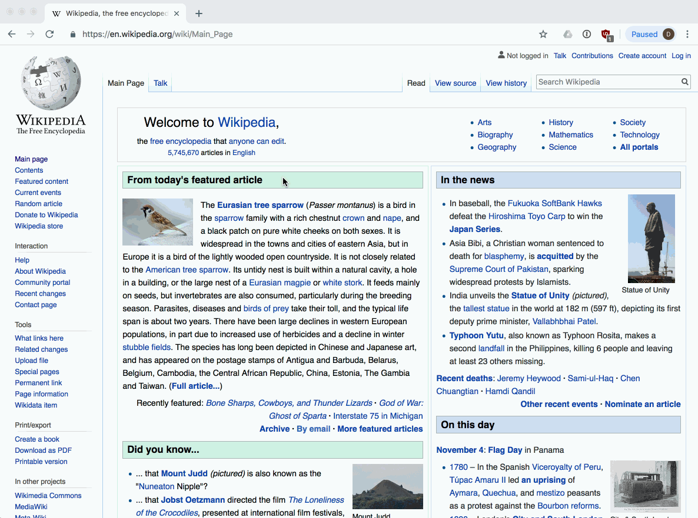

# WEB222 - Week 8

## Suggested Readings

* [Introduction to CSS](https://developer.mozilla.org/en-US/docs/Learn/CSS/Introduction_to_CSS)
* [Learning to Style HTML using CSS](https://developer.mozilla.org/en-US/docs/Learn/CSS)
* [CSS: Cascading Style Sheets on MDN](https://developer.mozilla.org/en-US/docs/Web/CSS)

## Cascading Style Sheets (CSS)

In HTML5 we don't include markup related to how our page should look; instead we focus on
its structure, layout, and organization.  We put all this information in style sheets: text
files that define CSS *selectors* and *rules* for how to style our HTML elements.

CSS allows us to specify styles, layout, positioning, and other "style" properties for HTML elements.
CSS makes it possible for a page's style information to be separated from its structure and content.
Consider how much of an impact CSS can have on the same HTML:

* [CSS Zen Garden](http://www.csszengarden.com/)
* [CSS Zen Garden HTML file](zengarden.html)
* [CSS Zen Garden CSS file](zengarden-style.css)

## CSS Syntax

CSS syntax is made up of *rules*, which are broken into two parts:

1. a *selector*, specifying the element(s) that should have the rules applied
1. one or more *declarations*, which are *key/value* pairs surrounded by `{...}` braces

```css
h1 {
    color: blue;
    font-size: 12px;
}
```

In this example, the *selector* is `h1`, which indicates that we want the following
rules to be applied to level-1 heading elements (i.e., all `<h1></h1>` elements in the document).
Next comes a list of two definitions, each ending with a `;`.  These declarations
follow the usual key/value syntax, with a *property* name coming before the `:`, and a *value*
coming after:

* `color: blue;` says we want to use the colour (note the spelling) blue
* `font-size: 12px;` says we want the font to be 12px.

Here's another example:

```css
p {
    color: red;
    text-align: center;
    text-decoration: underline;
}
```

This indicates we want all `<p></p>` elements in the document to have red, centered, underlined text.

## Where to Put CSS

CSS can come from a number of sources in an HTML page:

1. Inline
1. Internal Embedded
1. External File(s)
1. The browser itself (e.g., [default styles](https://github.com/mozilla/gecko-dev/blob/master/layout/style/res/html.css), or extra styles injected by a browser extension)

Browsers apply styles to elements using a priority order that matches the list above.
If more than one style rule is specified for an element, the browser will prefer whatever
is defined in Inline styles over Internal Embedded, Internal Embedded over External files, etc.  

### Inline Example

CSS rules can be placed directly on an element via the `style` attribute:

```html
<div style="background-color: green">...</div>
```

### Internal Embedded

If we want to apply the same CSS rules to more than one element, it makes more sense to
*not* duplicate them on every element's `style` attribute.  One solution is to use an internal embedded
`<style>` element in the `<head>` or `<body>`, similar to how embedded `<script>` elements work:

```html
<style>
    p { color: red; }

    div {
        background-color: blue;
        text-align: center;
    }
</style>
```

### External File(s)

Putting large amounts of CSS in `<style>` elements makes our HTML harder to read and maintain
(CSS is about separating style from structure), and also causes our page to perform worse
in terms of load times (i.e., the styles can't be cached by the browser).  To overcome this,
we often include external `.css` files via the [`<link>`](https://developer.mozilla.org/en-US/docs/Web/HTML/Element/link)
element within the document's `<head>`:

```html
<!doctype html>
<html>
    <head>
        <link rel="stylesheet" href="styles.css" type="text/css">
    </head>
```

We can include many stylesheets in this way (i.e., everything doesn't have to go in one file),
and we can include `.css` files on the same origin, or a remote origin:

```html
<!doctype html>
<html>
    <head>
        <link rel="stylesheet" href="https://stackpath.bootstrapcdn.com/bootstrap/4.1.3/css/bootstrap.min.css">
        <link rel="stylesheet" href="styles.css" type="text/css">
    </head>
```

In the example above, the page uses the popular [Bootstrap](https://getbootstrap.com/) CSS styles
along with some locally (i.e., local to the web server) styles in `styles.css`.

A `.css` file included in this way can also [`@import`](https://developer.mozilla.org/en-US/docs/Web/CSS/@import)
to have even more `.css` files get loaded at runtime:

```css
/* Import Font Awesome */
@import url(https://use.fontawesome.com/releases/v5.4.2/css/all.css)
```

In this example, the popular [Font Awesome](https://fontawesome.com/) CSS library for font icons
has been imported via a `.css` file.

## CSS Selectors

We've already learned a few CSS Selectors when we discussed `querySelector()` and
`querySelectorAll()`.  The word `Selector` refers to the fact that these methods take
a CSS Selector and return DOM elements that match.  For example:

* `document.querySelector('#output')` would return the element with attribute `id="output"`
* `document.querySelectorAll('.logo')` would return all elements with a class of `logo`
* `document.querySelectorAll('img')` would return all `` elements

These same selectors, and many more, can also be used in our CSS rulesets.

### Tag/Type Selectors

The name of an HTML element can be used to specify the styles associated with all
elements of the given type.  For example, to [indent all `<p>` text](https://developer.mozilla.org/en-US/docs/Web/CSS/text-indent) in our document, we could do this:

```css
p {
    text-indent: 20px;
}
```

### Class Selectors

Often we want to apply styles to *some* but not *all* elements of a certain kind.  Perhaps
we only want some of our page's `<p>` elements to have a particular look.  To achieve this, 
we define a *class*, and then put that class on the elements that require it:

```html
<style>
    .demo {
        text-decoration: underline red;
    }
</style>

<p>This is a paragraph that won't get the styles below applied to it (doesn't include the class)</p>
<p class="demo">This paragraph will get the styling applied.</p>
<p class="demo">And so will this one.</p>
```

A class can be applied to elements that aren't of the same type:

```html
<style>
    .invisible {
        display: none;
    }
</style>

<h1 class="invisible">Title</p>
<p class="invisible">This is a paragraph.</p>
```

I this example, both the `<h1>` element, and the `<p>` element will have the `display: none` style applied,
hiding them so they don't appear in the page.

If we want to be more specific, and only apply styles to elements of a given type which also have
a given class, we can do this:

```html
<style>
    p.note {
        font-weight: bold;
    }
</style>

<p class="note">This is a paragraph that also uses the note class.</p>
<div class="note">This div uses the note class too, but because we said p.note, no styles are used.</div>
```

An element can also have multiple classes applied, each one adding different styling:

```html
<style>
    .invisible {
        display: none;
    }

    .example {
        color: green;
        background-color: red;
    }
</style>

<p class="invisible example">This is a paragraph that uses two classes at once.</p>
```

### ID Selectors

In many cases, we have only a single element that should use styles.  Using a type
or class selector would be overly broad, and so we tend to use an `id` instead.
Recall that only one HTML element in a document can have a given `id` attribute:
it must be unique.

```html
<style>
    #summary {
        background-color: skyblue;
    }
</style>

<div id="summary"></div>
```

When we use the `id` as a selector, we prefix it with the `#` symbol.  Notice that
the HTML does *not* use the `#` symbol though.

### Contextual Selectors

Another common way to write selectors is to use the position of elements in the DOM.
The *context selector* indicates the context, or placement/nesting (i.e., determined by the
parent node) of the element.

For example, if we want to apply styles to `<p>` elements that are children of `<div>`
elements, we could do this:

```html
<style>
    div p {
        font-size: 16px;
    }
</style>

<p>This paragraph will not receive the styling</p>

<div>
    <p>This paragraph will receive the styling.</p>
    <p>This paragraph will receive the styling also.</p>
</div>
```

### Grouping Selectors

As our CSS grows, it's common that we'll notice that we're repeating the same things
multiple times.  Instead of doing this, we can group a number of selectors together into
a comma-separated list:

```css
html, body {
    height: 100%
}

h1,
h2,
h3,
h4,
h5,
h6 {
    font-family: Serif;
    color: blue;
}
```

Here we've used grouping twice to cut-down on the number of times we have to repeat things.
In the first case, we defined a height of `100%` (full height of the window) for the `<html>`
and `<body>` elements (they don't have a height by default, and will only be as tall as
the content within them).  We've also declared some font and color information for all the
headings we want to use.

## Containers for Styling

We've discussed `<div>` and `<span>` in the past, but their purpose may not have been clear.
Why bother wrapping other elements in `<div>...</div>` or `<span>...</span>` when they don't
display any different?

With CSS we can now start to take advantage of what they provide.  If we think of them as
containers which can be used to group styling, their purpose will become more clear.

A `<div>` is a block level element, and `<span>` an inline element.  Depending on how we want
to group and apply styling, we can use one or both.  Consider the following:

```html
<style>
    .info-box {
        border: solid green;
    }

    .info-box p {
        font-family: Serif;
    }

    .info-box span {
        font-weight: bold;
    }

    .info-box img {
        width: 75px;
        height: 75px;
    }
</style>

<p>This paragraph won't have any special style applied.  Neither will this <span>span</span>.</p>

<div class="info-box">
    <p><span>Name:</span> Thomas Lee</p>
    <p><span>Age:</span> 23</p>
    
</div>
```

## CSS Units

Many CSS values require units to be specified, for example, font sizes, widths, heights, etc.
At first you might think that we should specify things in pixels; however, browsers need to work
on such a wide variety of hardware and render to so many different displays (watches to billboards), 
we need more options.  It's also important to be able to specify sizes using relative units vs. fixed,
for layouts that need to adapt to changing conditions and still retain the correct proportions.

There is one exception, and that is for `0` (i.e., zero), which never needs a unit (i.e., `0px` is the
same as `0%`, etc).

The most common units we use in CSS are:

```
1em = 12pt = 16px = 100%
```

Let's look at each of these in turn:

* `em` (the width of the capital letter `M`) - a scalable unit that is used in web media, and is equal to the current `font-size`.  If the `font-size` is `12pt`, `1em` is the same as `12pt`.  If the `font-size` is changed, `1em` changes to match.  We can also use multiples: `2em` is twice the `font-size`, and `.5em` is half.  Using `em` for sizes is popular on the web, since things have to scale on mobile vs. desktop (i.e., fixed unit sizes don't work as the screen shrinks/expands).
* `pt` - a fixed-size *Point* unit that comes from print media, where `1pt` equals `1/72` of an inch.
* `px` - pixels are fixed size units for web media (screens), and `1px` is equal to one dot on a computer display.  We use `px` on the web when we need "pixel perfect" sizing (e.g., image sizes).
* `%` - the percent unit is similar to `em` in that it scales with the size of the display.  `100%` is the same as the current `font-size`.
* `vw`, `vh` - the viewport width and height units are percentages of the visible space in the viewport (the part of the page you can see, the window's width and height).  `1vw` is the same as `1%` of the width of the viewport, and `80vh` is the same as `80%` of the visible height.

You will also sometimes encounter other ways of measurement that use full words: `xx-small, x-small, small, medium, large, x-large, xx-large, smaller, larger, thin, medium, thick`

Here's an example that uses a number of the units mentioned above:

```html
<style>
    html, body {
        height: 100vh;
    }

    .box {
        margin: 10px;
        font-size: 2em;
        height: 150px;
        border: medium solid black;
    }
</style>
<div class="box"></div>
```

## CSS Colours (`color`)

CSS allows us to define colour values for many declarations.  We do so by specifying
a colour using one of the following notations:

* Hexadecimal Red, Green, Blue: written using 3 double-digit hex numbers, and starting with a `#` sign.  Each of the 3 pairs represents a value between 0 and 255 for Red, Green, and Blue: `#000000` is pure Black and `#ffffff` is pure White, and `#ffd700` is Gold.
* RGB or RGBA notation: here the red, green, blue, and sometimes alpha (i.e., opacity) are defined in decimal notation: `#ffffff` is the same as `rgb(255, 255, 255)` and `#ffd700` is the same as `rgb(255, 215, 0)`.  If we want to define how see-through the colour is (by default you can't see through a colour), we add an alpha value: `rgba(0, 191, 0, 0.5)` means that the colour will be 50% see through.
* Named colours: some colours are so common that they have their own [name defined in the CSS standard](https://developer.mozilla.org/en-US/docs/Web/CSS/color_value#Color_keywords).  For example: `white`, `black`, `green`, `red`, but also `chocolate`, `darkorange`, `peru`, etc.

The easiest way to understand this is using a [Colour Picker tool](https://developer.mozilla.org/en-US/docs/Web/CSS/CSS_Colors/Color_picker_tool), which lets you visually see the difference in changing values.

## CSS Properties and Values

A *property* is assigned to a selector in order to manipulate its style.  The [CSS properties](https://developer.mozilla.org/en-US/docs/Web/CSS/Reference) are defined as part of the CSS standard.
When you want to know how one of them works, or which values you can assign, you can look at the documentation
on MDN.  For example:

* [`text-indent`](https://developer.mozilla.org/en-US/docs/Web/CSS/text-indent)
* [`color`](https://developer.mozilla.org/en-US/docs/Web/CSS/color)
* [`background-color`](https://developer.mozilla.org/en-US/docs/Web/CSS/background-color)
* [`border`](https://developer.mozilla.org/en-US/docs/Web/CSS/border)

There are hundreds of properties we can tweak as web developers, and it's a good idea to explore
what's available, and to look at how other web sites use them via the developer tools.

A property can have one or more values.  A the possible values a property can have also comes
from the standard.  For example:

```css
p {
    text-decoration: underline;
}

.spelling-error {
    text-decoration: red wavy underline;
}
```

The [`text-decoration`](https://developer.mozilla.org/en-US/docs/Web/CSS/text-decoration) property is defined
to take one of a number of values, each of which is also defined in the standard.

## Exploring CSS Properties and Values in the Dev Tools

By far the best way to learn about CSS is to look at how other sites use it.  When you find
something on the web that you think looks interesting, open your browser's dev tools and inspect
the CSS Styles:



You can look at the specific properties specified for an element, or see all the *computed* styles
(i.e., everything, including all default values).  You can also try toggling these on and off, or
double-click the values to enter your own.

## CSS `text` Properties

There are [dozens of properties that affect how text is rendered](https://developer.mozilla.org/en-US/docs/Learn/CSS/Styling_text/Fundamentals).  These include
things like the color, spacing, margins, font characteristics, etc.

```css
h2 {
    color: red;
    text-align: center;
    text-decoration: underline;
    text-transform: uppercase;
}

p {
    color: #0000ff;
    text-indent: 100px;
}
```

### `font` Properties

We can use the `font-family` property to specify a font, or list of fonts, for the
browser to apply to an element.  The font must be available on the user's computer,
otherwise the next font in the list will be tried until one is found that is installed,
or a default font will be used.

In general it is safe to assume that the following fonts are available:

* `Helvetica, Arial, Verdana, sans-serif` - sans-serif fonts
* `"Courier New", Courier, monospace` - monospace fonts
* `Georgia, "Times New Roman", Times, serif` - serif fonts

You can see a [list of the fonts, and OS support here](https://www.cssfontstack.com/).

```css
h3 {
    font-family: Arial;
}

h4 {
    font-family: "Times New Roman", Times, serif;
}

h5 {
    font-size: 18pt;
    font-style: italic;
    font-weight: 500
}
```

### Web Fonts - `@font-face`

Modern browsers also allow [custom fonts to be included](https://developer.mozilla.org/en-US/docs/Learn/CSS/Styling_text/Web_fonts#Web_fonts) as external files, and downloaded
as needed by the web site.  This is often the preferred method for designers, who don't
want to be limited to the set of fonts available on *all* operating systems.

A font is a file that describes the curves and lines needed to generate characters at
different scales.  There are various formats, from `OTF` (OpenType Format) to
`TTF` (TrueType Format) to `WOFF` (Web Open Font Format), etc.  In order for 
the browser to use a new font, it has to be downloadable via one or more URLs.
We then tell the browser which font files to download in our CSS via the
`@font-face` property:

```css
@font-face {
    font-family: "FontName"
    src: url(font.woff2) format('woff2'),
         url(font.ttf) format('truetype');
}

body {
    font-family: "FontName";
}
```

Many fonts have to be purchased, but there are some good sources of high quality,
freely available fonts for your sites:

* [Font Squirrel](https://www.fontsquirrel.com/)
* [dafont.com](https://www.dafont.com/)
* [Google Fonts](https://fonts.google.com/)

For example, we can use the popular [`"Lobster"`](https://fonts.google.com/specimen/Lobster) font
from Google by doing the following in our CSS:

```css
@import url(https://fonts.googleapis.com/css?family=Lobster)

p {
    font-family: "Lobster";
}
```

### `font-size` property

Using the [`font-size`](https://developer.mozilla.org/en-US/docs/Web/CSS/font-size) property, font sizes
can be given in fixed or relative units, depending on how we want our text to scale on different devices:

```css
h1 {
    font-size: 250% /* scaled to 250% of regular font size */
}

p {
    font-size: 20pt /* size in points -- 20/72 of an inch */
}

.quote {
    font-size: smaller; /* smaller than normal size */
}

.bigger {
    font-size: 1.5em; /* 1.5 times larger than the 'M' in normal font size */
}
```

### Text Effects

There are numerous effects that can be added to text (or any element), many beyond
the scope of this initial exploration of CSS.  Here are a few simple examples to
give you an idea

[`text-shadow`](https://developer.mozilla.org/en-US/docs/Web/CSS/text-shadow) allows a
shadow to be added to text, giving it a 3-D style appearance.  The value includes a colour,
`x` and `y` offsets that determine the distance of the shadow from the text.  Finally, we
can also add a `blur-radius`, indicating how much to blur the shadow.

```css
.shadow-text {
    text-shadow: 1px 1px 2px pink;
}
```

[`text-overflow`](https://developer.mozilla.org/en-US/docs/Web/CSS/text-overflow) can be used
to determine what the browser should do when the amount of text exceeds the available space
in a container (e.g. in a `<div>` or `<p>` that isn't wide enough).  For example, we can specify
that we want to `clip` the contents and not show any more, or we can automatically display `...`,
the `ellipsis`.

```html
<style>
.movie-title {
    text-overflow: ellipsis;
}
</style>
<span class="movie-title">Pirates of the Caribbean: The Curse of the Black Perl</span>
```

## `background` Properties

Every element has a background that we can modify.  We might, for example, want to
specify that the background be a certain colour; or we might want to use an image,
or even tile an image multiple times (like wallpaper to create a pattern); or we
might want to create a gradient, from one colour to another.  All of these options
and more are possible using the [`background`](https://developer.mozilla.org/en-US/docs/Web/CSS/background)
property.

```css
div.error {
    background: red;
}

div.wallpaper {
    background: url("pattern.jpg") repeat;
}
```

## Styling Links

We can control the way that links (i.e., `<a>`) appear in our document.  By default
they will have a solid blue underline, and when visited, a purple solid underline.
If you want to remove the underline, or change it's colour to match the theme of a page,
we can do that using CSS [`pseudo-classes`](https://developer.mozilla.org/en-US/docs/Web/CSS/Pseudo-classes).

With *pseudo-classes* we can specify certain states for the elements in our selector,
for example:

* `a:link` - a normal, unvisited link (normally blue underline)
* `a:visited` - a link the user has visited previously (normally purple underline)
* `a:hover` - a link when hovered with the mouse
* `a:active` - a link when it is clicked (i.e., while the mouse button is pressed)

> NOTE: pseudo-classes can be used with any element, but we mention them here in relation
to styling links, since we often need them to deal with different states for a link.

Let's alter our links so that they use blue text, with no underline.  However, when hovered,
add back the underline:

```css
a:link, a:visited {
    text-decoration: none;
}

a:hover, a:active {
    text-decoration: underline;
}
```

## CSS and the DOM via JavaScript

We've been discussing CSS in the context of HTML, but we also need to explore how to
work with it via JavaScript.  The DOM provides us a [number of methods](https://developer.mozilla.org/en-US/docs/Web/API/CSS_Object_Model/Using_dynamic_styling_information)
for examining and changing the CSS styles associated with elements.

First, we can use a DOM element's [`style`](https://developer.mozilla.org/en-US/docs/Web/API/HTMLElement/style) property.
Doing so gives us access to the inline `style` attribute of the element.
We can get or set particular CSS property values via the `style` element using *camelCase* versions
of the CSS property names.  For example, `background-color` becomes `backgroundColor`, while `width` remains `width`.

```js
// Change the background colour of all paragraphs to red
var elems = document.querySelectorAll('p');
for(var i = 0, len = elems.length; i < len; i++) {
    elems[i].style.backgroundColor = 'red';
}
```

Usually we don't need (or want) to alter properties one by one via the DOM.  Instead,
it's more common to add or remove classes to elements, which pre-define a set of properties.

Similar to an element's `style` property, we can also use its `classList` property.  It has
a number of useful [methods](https://developer.mozilla.org/en-US/docs/Web/API/Element/classList#Methods):

* `add()` - adds one (or more) class names to the element.  If any of them are already present, they are ignored.
* `remove()` - removes one (or more) class names from the element.
* `toggle()` - toggles a class name on (adds it) or off (removes it), depending on the current state.
* `contains()` - checks if the specified class name is already defined for this element.
* `replace()` - replaces an old class name with the new one.

Using classes and `classList`, it's possible for us to define various states for our UI
by creating multiple classes, and then add/remove them at runtime as the program runs
and data changes.

Imagine you were creating a media player, and needed to show lists of songs and videos.
Some of the media has been played by the user, and some is new.  We can define classes
for both, and then use JavaScript to apply the correct class to each:

```html
<style>
    .media-played {
        background: gray;
    }

    .media-new {
        border: dashed red;
    }
</style>
...
<script>
    // Loop through an array of media objects, and set the class for each one
    mediaItems.forEach(function(media) {
        var mediaElem = document.getElementById(media.id);
        if(media.played) {
            mediaElem.add('media-played');
        } else {
            mediaElem.add('media-new');
        }
    });

    // When the user plays one of the media items, change it's display 
    function mediaPlayed(media) {
        var mediaElem = document.getElementById(media.id);
        mediaElem.replace('media-new', 'media-played');
    }
</script>
```

## Exercise: Using Third-Party CSS Libraries

We've been focused on the mechanics of writing CSS ourselves, and this is an
important skill.  In addition, it's a good idea to know how to use third-party
CSS libraries created by other developers.  There are many pre-existing CSS
libraries and frameworks we can use to help us create the web pages and apps
we desire.

### How to use Third-Party CSS

There is a general pattern to using any CSS library in your web page.

1. Find a library you want to use.  We've listed a number of interesting ones below.
2. Read the documentation.  Every library is different, and the "installation" and "usage" instructions will usually guide you on next steps.  Get used to reading technical documentation, so that you can learn to solve your own problems.
3. Figure out which file or files you need to include in your HTML.  This will typically include one or more `.css` files, and maybe `.js` ,fonts, etc.  You will likely need to use `<link>` and `<script>` elements
4. See if the CSS library you want to use is available via a [Content Delivery Network (CDN)](https://en.wikipedia.org/wiki/Content_delivery_network).  Try searching for your chosen library on [cdnjs](https://cdnjs.com/) or another CDN.
5. Read the docs for your library to see if you need to include any special markup, classes, or other info in your HTML file in order for things to work.  CSS libraries operate on HTML, and sometimes they will expect it to be in a particular format.

### Popular CSS Libraries

Here's a list of some popular CSS libraries and frameworks to get you started.

First, a few examples of simple "drop in" style libraries, where you simply include
the CSS file, and everything "Just Works":

* [Normalize.css](http://necolas.github.io/normalize.css/) - normalizes CSS so it is the same in all browsers ([CDN link](https://cdnjs.com/libraries/normalize))
* [Milligram](https://milligram.io/) - tiny set of default styles to make your site look great ([CDN link](https://cdnjs.com/libraries/milligram))
* [Bare.css](http://barecss.com/) - beautiful defaults with no classes ([CDN link](https://unpkg.com/bare-css@2.0.3/css/bare.min.css))
* [Tacit](https://yegor256.github.io/tacit/) - CSS framework with no classes.

Next, there are lots of stylesheets you can use to improve the readability of your text:

* [TufteCSS](https://edwardtufte.github.io/tufte-css/) - a stylesheet based on the ideas of Edward Tufte about typography and text ([CDN link](https://cdnjs.com/libraries/tufte-css))
* [Gutenberg](https://github.com/BafS/Gutenberg) - a drop-in stylesheet for Printing to a printer
* [Font Awesome](https://fontawesome.com/) - beautiful fonts and icons

In addition to changing how our text looks, a lot of CSS libraries add interesting
and playful animations and effects to spice up our HTML:

* [Hover](http://ianlunn.github.io/Hover/) - hover effects for links, buttons, and logs
* [Balloon.css](http://kazzkiq.github.io/balloon.css/) - tooltips and popups
* [Animate.css](http://daneden.github.io/animate.css) - animations for HTML elements
* [CSShake](http://elrumordelaluz.github.io/csshake/) - more animations for HTML elements ([CDN link](https://cdnjs.com/libraries/csshake))
* [CSSgram](https://una.im/CSSgram/) - Instagram style filters for HTML images


Another common problem CSS can solve is what to do while we wait for things to finish
loading:

* [SpinKit](http://tobiasahlin.com/spinkit/) - loading animations ([CDN link](https://cdnjs.com/libraries/spinkit))
* [CSS Loader](http://www.raphaelfabeni.com.br/css-loader/) - more loading animations ([CDN link](https://cdnjs.com/libraries/css-loader))

Many CSS libraries have grown into more complex suites of layout, component, typography,
navigation, and other solutions.  We often refer to these as "frameworks" to indicate the
expanded scope.  There are many to choose from, including:

* [Pure.css](https://purecss.io/) - tiny CSS framework for responsive layouts, buttons, forms, menus, etc. 
* [Boilerform](https://boilerform.design/) - simplify creating HTML forms
* [PaperCSS](https://www.getpapercss.com/) - playful, hand-drawn style UI kit
* [Bootstrap](http://getbootstrap.com/) - one of the most popular UI grid and component system for mobile and desktop web.  Lots of themed versions of this too, for example [Material UI](http://daemonite.github.io/material/)
* [UIKit](https://getuikit.com/) - lightweight toolkit for building web app front-ends
* [Semantic UI](https://semantic-ui.com/) - UI framework, lots of responsive components ([CDN link](https://cdnjs.com/libraries/semantic-ui))
