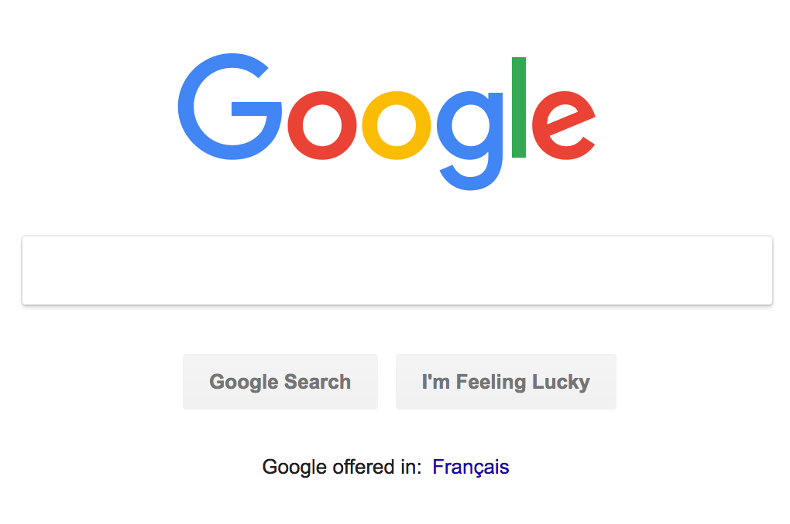
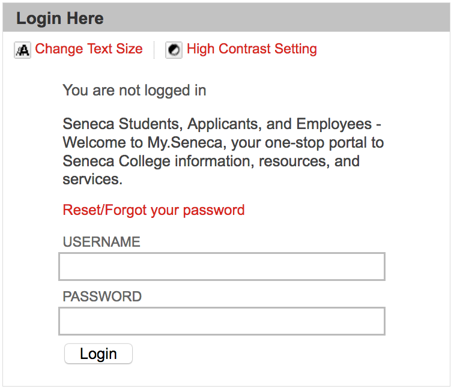
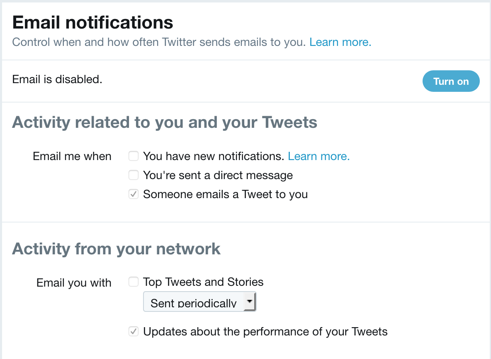
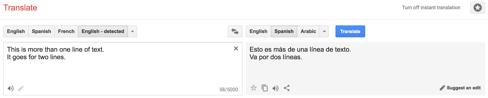
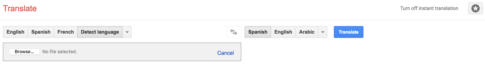

# WEB222 - Week 10

## Suggested Readings

* [HTML Forms](https://developer.mozilla.org/en-US/docs/Learn/HTML/Forms)
* [Designing Efficient Web Forms: On Structure, Inputs, Labels and Actions](https://www.smashingmagazine.com/2017/06/designing-efficient-web-forms/)
* [Create Amazing Forms](https://developers.google.com/web/fundamentals/design-and-ux/input/forms/)
* [Bootstrap Forms](https://getbootstrap.com/docs/4.1/components/forms/)

## HTML5 Forms

Up to this point, most of our web pages have been read-only from the point of view
of a user.  Users could read, view, watch, or listen to content on the page, and
maybe interact with it via JavaScript events or CSS.  However, we haven't given
our users a way to share data with us.

HTML provides a mechanism to overcome this problem using forms.  Forms provide
users a method of entering data on a web page.  This data could be used directly in
the page (e.g., change display options), or could be sent on to a web server
(e.g., logging into a site, adding data to a database).

Every time we log-in, purchase items at an online store, or perform a search,
we are using forms.

### `<form>`, `<input>`, and other Form markup

An HTML form is created using special markup and a number of special-purpose
elements.  The browser provides the user with custom components for entering,
modifying, or even uploading data to be associated with our form.  We'll begin
by learning how to create, use, and style these form elements, and later look
at how to work with the data programmatically in JavaScript.

The most important element for creating web forms [`<form>`](https://developer.mozilla.org/en-US/docs/Web/HTML/Element/form).  A `<form>`
element represents a section of a web page that contains interactive controls
that a user can use to enter and submit data to the web page or server.  The
`<form>` element is a special type of container element, which we use to define
information about how to send the user's data to a server:

```html
<form id="data" action="/submit" method="post">

</form>
```

The `<form>`'s `action` attribute defines the URL where the data should be sent when submitted. In this case `/submit` really means *"send this data to the same web server as the page was served from, and to the /submit route"*. Sometimes you'll also use `action="#"` to indicate that the form is to be processed in the browser, but not sent to any server URL.  
The `method` tells the browser which HTTP method to use when submitting the data to the URL defined in `action`.  By default this will be `GET`, and all form options will be sent as query string values on the URL.  When submitting a lot of form data, we can also use `POST`, which will include the information in the request's headers instead, allowing more content to be sent (i.e., URLs have a maximum length).

A `<form>` contains various elements that make up the set of inputs and widgets available
to the user.  The most common type of input control is the [`<input>`](https://developer.mozilla.org/en-US/docs/Web/HTML/Element/input) element.

An `<input>` element represents an interactive form control used to accept data from the
user.  There are [dozens of different types](https://developer.mozilla.org/en-US/docs/Web/HTML/Element/input#Form_%3Cinput%3E_types) of input controls, with new ones still be added.  Here's a basic `<input>` element for a user to enter their name in a textbox:

```html
<input id="name" type="text" name="first-name">
```

The `<input>` element is used to tell the browser we want an input control to be created on the page. Notice that `<input>` elements are empty (i.e., no content) and don't have a closing tag. All of the information is stored in attributes on the element. As with all HTML elements, it's common (but not required) for an `<input>` control to have an `id` attribute,
which uniquely identifies this control.  In addition, we also specify a `name="first-name"`
attribute, which is used later to associate the value entered by the user with the particular control on the form--in this case, the value entered by the user will be
called `first-name` when the form gets processed.  Finally, we have a `type="text"`
attribute, indicating that this form control should be rendered in the page as a textbox.

There are many more form elements, attributes, and input types to learn.  Let's continue
by looking at some well-known, real-world examples of forms and how they are built. 

#### Form Example 1: Google Search

Our first example is perhaps the most popular form on the web:



Here's a simplified version of the HTML Google uses to create that form (if you
want to see the original, open your browser's dev tools on the Google home page
and inspect the elements yourself):

```html
<form id="tsf" class="tsf nj" action="/search" method="GET" name="f">
    <input name="source" type="hidden" value="hp">
    <input value="qIXxW6O0FeTMjwT1zpioCA" name="ei" type="hidden">
    <input class="gLFyf gsfi" maxlength="2048" name="q" type="text" title="Search">
    <input value="Google Search" name="btnK" type="submit">
    <input value="I'm Feeling Lucky" name="btnI" type="submit">
</form>
```

Let's examine this code for a moment and try to understand what's happening.

First, notice that all of the input controls (i.e., the search text box and
both buttons), are grouped together inside a `<form></form>` element.

The `<form>` element has a number of attributes, some we've seen before (`id`, `class`), and others are new:

* `name="f"` - before browsers standardized on using `id` to identify elements, forms used to have a `name` attribute to identify a form in the page (i.e., if there was more than one).
* `action="/search"` - tells the browser where the data in the form is meant to be submitted. In this case `/search` really means the URL `https://google.com/search`. Sometimes you'll also use `action="#"` to indicate that the form is to be processed in the browser, but not sent to any server URL.
* `method="GET"` - tells the browser to use the HTTP `GET` method when submitting this form.  In this case, the amount of data being sent is small enough that it can fit everything on the URL.

The `<form>` element then contains a number of elements that represent form input controls.
Google uses the most common form control, `<input>`, to build the form, creating
three different kinds of form controls:

1. Hidden Input Controls: `<input name="source" type="hidden" value="hp">` and `<input value="qIXxW6O0FeTMjwT1zpioCA" name="ei" type="hidden">` - these are `hidden` form controls.  They won't be visible to the user, but allow for extra information to be stored in a `value` that will get submitted with the form.  Think of these `hidden` controls as variables.  In this case, Google is storing information about the fact that we're doing our search from the Home Page (`name="source" value="hp"`) and also including a [special timestamp](https://deedpolloffice.com/blog/articles/decoding-ei-parameter) (`value="qIXxW6O0FeTMjwT1zpioCA" name="ei"`) indicating when this query was made.  In both cases the `name` and `value` attributes are used to indicate key/value pairs in the form data.
1. Text Input Control: `<input class="gLFyf gsfi" maxlength="2048" name="q" type="text" title="Search">` - this is a `text input` form control.  This control gets rendered as a textbox in the browser, which the user can focus and enter text with the keyboard.  The default `type` of a form control is `text`.  As we discussed above, all `<input>` elements need a `name` attribute to uniquely identify the `value`.  In this case the `name` is `q`, short for query, and there is no defined `value`, since the user will provide it.  Also note the use of the `maxlength="2048"` attribute, which tells the browser not to let the user type more than 2,048 characters in this textbox.
1. Submit Button Controls: `<input value="Google Search" name="btnK" type="submit">` and `<input value="I'm Feeling Lucky" name="btnI" type="submit">` - these are `submit` form controls, which literally submit (upload) the `<form>`'s data using the HTTP `method` to the `action` URL.

If I enter some some text in the textbox, `cat pictures`, and click the `Google Search`
submit button, my browser submits the form to `/search` as a `GET` request, encoding
all the values in the form into query string values on the URL: 

https://www.google.com/search?source=hp&ei=qIXxW6O0FeTMjwT1zpioCA&q=cat+pictures&btnK=Google+Search

If we break that URL apart, we notice the following:

* `https://www.google.com` the origin
* `/search` - the pathname
* `?source=hp&ei=qIXxW6O0FeTMjwT1zpioCA&q=cat+pictures&btnK=Google+Search` the query string, with the submitted form values `source=hp`, `i=qIXxW6O0FeTMjwT1zpioCA`, `q=cat+pictures`, and `btnK=Google+Search` separated by `&`

We could have manually entered that URL and gotten our search results.  However, by
using a `<form>` and submitting via a `GET` request, the browser has created it for us.

#### Form Example 2: My Seneca Login

Our second example is well known to Seneca students: the login form on https://my.senecacollege.ca:



Here's a simplified version of the HTML used to create it:

```html
<form action="/webapps/login" method="POST" name="login">
    <label for="user_id">Username</label>
    <input id="user_id" type="text" name="user_id" size="25" maxlength="50">

    <label for="password">Password</label>
    <input id="password" type="password" name="password" autocomplete="off" size="25">

    <input id="entry-login" type="submit" class="button expand" value="Login" name="login">
    <input type="hidden" name="action" value="login">
    <input type="hidden" name="new_loc" value="">
</form>
```

This does many similar things to Google's search form, so let's focus on the differences.

First, this form uses a new HTML element, [`<label>`](https://developer.mozilla.org/en-US/docs/Web/HTML/Element/label),
to add a text label to the two textboxes.  Each label is a caption of text that
gets associated with an `<input>` control by specifying a `for="..."` attribute
that links it to the `id` of the correct control.  We see two instances of this,
one for `Username`, which connects with the `user_id` input control, and `Password`
for `password`.

Second, the `user_id` input control is of type `text`, but it specifies both
`size="25"` and `maxlength="50"`.  This tells the browser to render a textbox
that can display 25 characters, and to not allow the user to enter any characters
beyond 50.

Third, the `password` input control is not of type `text`, but rather [`password`](https://developer.mozilla.org/en-US/docs/Web/HTML/Element/input/password).
This tells the browser to render a textbox, but hide the characters the user enters.
In a desktop browser this might mean using `*` for every character; in a mobile browser
this might mean that each character is shown for a second, and then replaced by a `•`. 
The `password` control also specifies `size="25` to indicate that users shouldn't be
able to type (or paste) more than 25 characters.  The [`autocomplete="off"`](https://developer.mozilla.org/en-US/docs/Web/HTML/Element/input/password#Allowing_autocomplete) attribute
is used as a hint to the browser that it shouldn't try and automatically fill-in
the password field.  Most browsers ignore this request, since [password managers](https://en.wikipedia.org/wiki/Password_manager) have become so common.

Finally, notice that the `<form>` uses `method="POST"` instead of `GET`, and
`action="/webapps/login"`.  This means that when we submit the `<form>`, the data
will be `POST`ed to `https://my.senecacollege.ca/webapps/login/`.  A `POST` differs
from a `GET` in that the form data will be encoded and included in the body of the
HTTP request instead of the URL.  If I try to login with a `username` of `john`
and a `password` of `123`, here's a simplified version of the HTTP request that
gets sent to the web server:

```http
Host: my.senecacollege.ca
Accept: text/html,application/xhtml+xml,application/xml;q=0.9,*/*;q=0.8
Content-Type: application/x-www-form-urlencoded
Content-Length: 59

action=login&login=Login&new_loc=&password=123&user_id=john
```

Notice the `Content-Type` is set to be [`application/x-www-form-urlencoded`](https://developer.mozilla.org/en-US/docs/Web/HTTP/Methods/POST#Example), which means
we're submitting form data.  Also notice that the body of the request (everything
after the blank line), is our form data in the form `name=value` with each one
separated by a `&` symbol.

Notice too how the password I entered is being sent in plain text!  Even though
the browser masked the password when I entered it in the `password` control, it
ends up being sent to the server without being encrypted or altered in anyway.  This
is important to understand, both as a user and developer, since you only want to submit
sensitive form data to secure origins (i.e., using `https`).

#### Form Example 3: Twitter Email Notification Settings

Let's look at another, somewhat more complex form, this time from Twitter's settings:



Here's a simplified version of the HTML used to create it:

```html
<form id="notifications-form" method="POST" action="/settings/email_notifications/update">
    <fieldset class="control-group">
        <legend class="control-label">Email me when</legend>
        <label class="t1-label checkbox">
            <input type="checkbox" value="1" id="send_network_activity_email" name="user[send_network_activity_email]" disabled="">
            You have new notifications.
            <a href="https://support.twitter.com/articles/127860#tweet-activity" target="_blank" class="learn-more" rel="noopener">Learn more.</a>
        </label>
        <input type="hidden" value="0" name="user[send_network_activity_email]" disabled="">
        <label class="t1-label checkbox">
            <input type="checkbox" value="1" id="send_new_direct_text_email" name="user[send_new_direct_text_email]" disabled="">You're sent a direct message
        </label>
        <input type="hidden" value="0" name="user[send_new_direct_text_email]" disabled="">
        <label class="t1-label checkbox">
            <input type="checkbox" value="1" id="send_shared_tweet_email" name="user[send_shared_tweet_email]" checked="" disabled="">Someone emails a Tweet to you
        </label>
        <input type="hidden" value="0" name="user[send_shared_tweet_email]" disabled="">
    </fieldset>

    <hr>

    <fieldset class="control-group">
        <legend class="control-label">Email you with</legend>
        <label class="t1-label checkbox">
            <input type="checkbox" value="4" id="network_digest_schedule" name="user[network_digest_schedule]" disabled="">Top Tweets and Stories
        </label>
        <label class="t1-label">
        <span class="u-hiddenVisually">Preference</span>
        <select class="t1-select preference-dropdown" disabled="">
            <option value="1">Sent daily</option>
            <option value="3">Sent weekly</option>
            <option value="4" selected="selected">Sent periodically</option>
        </select>
        </label>
        <input type="hidden" value="0" name="user[network_digest_schedule]" disabled="">

        <label class="t1-label checkbox">
            <input type="checkbox" value="3" id="performance_digest_schedule" name="user[performance_digest_schedule]" checked="" disabled="">Updates about the performance of your Tweets
        </label>
        <input type="hidden" value="0" name="user[performance_digest_schedule]" disabled="">
    </fieldset>
</form>
```

This form doesn't have any controls where the user types text.  Instead, it uses
interactive checkboxes and dropdown menus.  It also introduces some more new form
elements to create sub-groups of options in a larger form. Let's once again focus on what's new.

The first thing we see is that the form is grouped into two sets of controls.  This
is achieved through the use of the [`<fieldset>`](https://developer.mozilla.org/en-US/docs/Web/HTML/Element/fieldset) container element.
The [`<legend>`](https://developer.mozilla.org/en-US/docs/Web/HTML/Element/legend) element
provides a caption for the groupings, "Email me When" vs. "Email you with".

Next we see a new type of `<input>` being used in order to create a [`checkbox`](https://developer.mozilla.org/en-US/docs/Web/HTML/Element/input/checkbox):

```html
<input type="checkbox" value="1" id="send_network_activity_email" name="user[send_network_activity_email]" disabled="">
```

In this case the checkbox is toggled on, and `value="1"` represents this in HTML.
It's not being done in this case, but often a checkbox will use the `checked` attribute
to indicate that the checkbox is checked, and `value` to specify what data will be
submitted with the form (it doesn't have to be 1 or 0, but could be any string).
This checkbox also includes the [`disabled`](https://developer.mozilla.org/en-US/docs/Web/HTML/Element/input#disabled)
attribute, indicating that while it is visible, it can't currently be changed.
In this case, the user would have to enable email settings for this control
to become alterable.

In addition to using multiple checkbox controls, this form also uses a dropdown
menu of options:

```html
<select class="t1-select preference-dropdown" disabled="">
    <option value="1">Sent daily</option>
    <option value="3">Sent weekly</option>
    <option value="4" selected="selected">Sent periodically</option>
</select>
```

The dropdown is created using a mix of [`<select>`](https://developer.mozilla.org/en-US/docs/Web/HTML/Element/select) and [`<option>`](https://developer.mozilla.org/en-US/docs/Web/HTML/Element/option) elements.
The `<select>` is a container for all the various possible options in the list.
Each option is defined via an `<option>`, which specifies a `value` (the data
that will be sent when the form is submitted), and the text to display.  By
including `selected="selected"` on one of options, the browser will show that
value as the chosen value when the page loads.

#### Form Example 4: Airbnb Search

Here's another form that introduces a few more concepts:


And the simplified HTML used to create it:

```html
<form id="MagicCarpetSearchBar" action="/s">
    <label class="_rin72m" for="magic-carpet-koan-search-bar">WHERE</label>
    <input type="text" class="_1wl3axt0" autocomplete="off" autocorrect="off" spellcheck="false" id="Koan-magic-carpet-koan-search-bar__input" name="query" placeholder="Anywhere" value="">
    
    <label class="_rin72m" for="checkin_input">CHECK IN</label>
    <input type="text" class="_14fdu48d" id="checkin_input" name="checkin" placeholder="dd-mm-yyyy" value="" readonly="">
    
    <label class="_rin72m" for="checkout_input">CHECK OUT</label>
    <input type="text" class="_14fdu48d" id="checkout_input" name="checkout" placeholder="dd-mm-yyyy" value="" readonly="">
    
    <label class="_rin72m" for="lp-guestpicker">GUESTS</label>
    <button class="_1nil34o" type="button">Guests</button>
    
    <button type="submit" class="_2giblnw">Search</button>
</form>
```

This `<form>` will be submitted to `https://www.airbnb.ca/s` using the default `GET`
method (all form data submitted on the URL's query string) when the `submit` button
is clicked.  However, notice how [`<button>`](https://developer.mozilla.org/en-US/docs/Web/HTML/Element/button)
elements have been used instead of `<input type="submit">`.  A `<button>` can be
used anywhere in (or outside of) a form where you need to have a clickable widget.
Here two `<button>`s are being used, one to submit the form, the other to provide
a custom entry for the number of guests (clicking the drop-down arrow reveals another form).

Something else that's new in this form is the use of new `<input>` attributes:

* [`autocomplete="off"`](https://developer.mozilla.org/en-US/docs/Web/HTML/Element/input#autocomplete) - disable autocomplete
* [`autocorrect="off"`](https://developer.mozilla.org/en-US/docs/Web/HTML/Element/input/text#autocorrect) - an Apple extension to the web, indicating whether to have the browser offer to autocorrect text entered by the user
* [`spellcheck="false"`](https://developer.mozilla.org/en-US/docs/Web/HTML/Element/input/text#spellcheck) - whether or not the browser should offer to spellcheck the text entered by the user.

Another new attribute has been used on the `<input>` elements to add placeholder
text:

```
placeholder="Anywhere"
...
placeholder="dd-mm-yyyy"
```

A `placeholder` is a hint provided to the user about what to enter, or the format.
It's text is not part of the value, and is not sent to the server.  The text
is usually rendered in a lighter colour, and will disappear when the user starts
typing.


#### Form Example 5: Google Translate

Our next example introduces two more styles of form input controls.  [Google Translate](https://translate.google.ca/)
allows users to enter text in one language and have it get translated by Google's
translation service.  There are a number of ways to enter text:

1. free-form text, which can span many lines
    
1. upload a file to be translated

    

Here's a simplified version of the HTML used to create this form:

```html
<form id="gt-form" action="/" name="text_form" method="post" enctype="multipart/form-data">
    <input type="hidden" id="gt-sl" name="sl" value="auto">
    <input type="hidden" id="gt-tl" name="tl" value="es">
    <input type="hidden" name="js" value="y" id="js">
    <input type="hidden" name="prev" value="_t" id="prev">
    <input type="hidden" name="hl" value="en" id="hl">
    <input type="hidden" name="ie" value="UTF-8">
    
    <textarea id="source-is" name="text-is" disabled="" dir="ltr" spellcheck="false" autocapitalize="off" autocomplete="off" autocorrect="off" class="goog-textarea short_text" wrap="SOFT"></textarea>
        
    <input type="file" name="file" id="file" size="40">
</form>
```

Once again, a `<form>` defines where and how to submit the user's data, and includes
various `hidden` controls that set default values for things like language choice.
However, notice that a new `enctype` has been used: `enctype="multipart/form-data"`.
This is done because whole files are being included beyond the usual form values.

What's new this time are the inclusion of a [`<textarea>`](https://developer.mozilla.org/en-US/docs/Web/HTML/Element/textarea)
and [`<input type="file">`](https://developer.mozilla.org/en-US/docs/Web/HTML/Element/input/file).

A `<textarea>` is used to create a multi-line text editing control.  In this
case it allows us to enter many lines of text.  A `<textarea>` has numerous
[attributes]( https://developer.mozilla.org/en-US/docs/Web/HTML/Element/textarea) that can be used to set things like the number of `rows` or `cols` (columns) to display, and
how to `wrap` the text--here `soft` is used to indicate that we want the lines to be
broken in the browser, but the text should not include `CR+LF` end of line pairs.

The `<input type="file">` control allows a user to `Browse...` for files (or folders) to
upload.  On the page a file upload control is displayed as a button, which when clicked
opens a File dialog box, allowing the user to navigate to their chosen file(s). The
files are then "uploaded" to the web page, before being included in the form submission
and sent to the server. 

### Leverage the Platform: the right control

Before we look at styling, and think about custom UI, it's a good idea to remind ourselves about the built-in controls the web platform offers.  A textbox is often our first choice, but make sure you pick the [most appropriate input control type for the data you're expecting](https://developers.google.com/web/fundamentals/design-and-ux/input/forms/#html5_input_types):

* [`<input type="tel">`](https://developer.mozilla.org/en-US/docs/Web/HTML/Element/input/number) - Telephone numbers. On mobile, the keyboard will show a keypad style entry vs. letters.
* [`<input type="url">`](https://developer.mozilla.org/en-US/docs/Web/HTML/Element/input/url) - URLs. On mobile, the keyboard will show extra buttons (e.g., `.com`) to make entering the URL easier.  URLs must begin with `http://` or another valid scheme.
* [`<input type="email">`](https://developer.mozilla.org/en-US/docs/Web/HTML/Element/input/email) - Email Address.  On mobile, the keyboard will include keys like `@` to make it easier to enter an email address.
* [`<input type="number">`](https://developer.mozilla.org/en-US/docs/Web/HTML/Element/input/number) - A Number (integer).  On mobile, the keyboard will switch to the number pad.
* [`<input type="range">`](https://developer.mozilla.org/en-US/docs/Web/HTML/Element/input/range) - A Number between two values (i.e., range of values) .  Gets displayed as a slider, making it easier to switch between values.
* [`<input type="date">`](https://developer.mozilla.org/en-US/docs/Web/HTML/Element/input/date), [`<input type="time">`](https://developer.mozilla.org/en-US/docs/Web/HTML/Element/input/time), [`<input type="week">`](https://developer.mozilla.org/en-US/docs/Web/HTML/Element/input/week), [`<input type="month">`](https://developer.mozilla.org/en-US/docs/Web/HTML/Element/input/month), [`<input type="date-local">`](https://developer.mozilla.org/en-US/docs/Web/HTML/Element/input/date-local) - Date/Time values (or portions thereof). Users are provided with special purpose date controls for entering valid dates, times, etc.
* [`<input type="color">`](https://developer.mozilla.org/en-US/docs/Web/HTML/Element/input/color) - Colour value. The OS will provide a colour picker control to visually select a colour.

The [list goes on](https://developer.mozilla.org/en-US/docs/Web/HTML/Element/input#Form_%3Cinput%3E_types), and it's worth familiarizing yourself with everything you can use.  Many of these
controls have [special native rendering, especially on mobile devices](https://developer.mozilla.org/en-US/docs/Learn/HTML/Forms/The_native_form_widgets).

### Leverage the Platform: give the browser hints for `name` and `autocomplete`

Browsers try to [autofill common field information](https://support.google.com/chrome/answer/142893) for users.  As a web developer, you can improve the user experience of your forms by giving the browser hints about
the data you're expecting for each form input field.

We do this using standard values for the `name="..."` and `autocomplete="..."` attributes on a form control.  For example, if we needed a username:

```html
<label for="username">Username</label>
<input type="text" name="username" id="username" autocomplete="username">
```

Or, if we needed a user's mobile telephone number:

```html
<label for="mobile-num">Mobile Number</label>
<input type="tel" name="mobile" autocomplete="tel" id="mobile-num">
```

There's a long list of [standard `name/autocomplete` values](https://html.spec.whatwg.org/multipage/form-control-infrastructure.html#autofill) that browsers know about and you should use whenever you want to help the user enter less information.

### Other `<input>` Attributes

We've already seen many attributes that can be used with `<input>` controls, but there
are some [other important ones](https://developer.mozilla.org/en-US/docs/Web/HTML/Element/input#Attributes) to know about:

* [`autofocus`](https://developer.mozilla.org/en-US/docs/Web/HTML/Element/input#autofocus) - if present, indicates that the input control should automatically get focused.
* [`required`](https://developer.mozilla.org/en-US/docs/Web/HTML/Element/input#required) - if present, indicates that the input control must have a value before the form can be submitted.
* [`tabindex`](https://developer.mozilla.org/en-US/docs/Web/HTML/Element/input#tabindex) - a number indicating the order in which each control should receive focus when the user press the `tab` key.  This is useful for keyboard navigation, which users to a lot with forms.
* [`list`](https://developer.mozilla.org/en-US/docs/Web/HTML/Element/input#list) - the `id` of a `<datalist>` element that provides autocomplete suggestions to be used for the control's value.  For example, providing a list of possible courses in a textbox:
    ```html
    <input type="text" list="subjects" name="course">
    <datalist id="subjects">
        <option value="EAC150">
        <option value="IPC144">
        <option value="ULI101">
        <option value="IOS110">
    </datalist>
    ```

## Forms and CSS

HTML forms have evolved and improved significantly in HTML5 and modern browsers.
As you learn how to create and style your own forms, be aware that many resources
give outdated advice, or use unnecessary workarounds and tricks to create functionality
that is now built into the web.

Form controls use the CSS box model, but [each one applies it slightly differently](https://developer.mozilla.org/en-US/docs/Learn/HTML/Forms/Styling_HTML_forms#Box_model).
This can make it hard to align everything.  We can make things easier by altering
our controls' [`box-sizing`](https://developer.mozilla.org/en-US/docs/Web/CSS/box-sizing) to use [`border-box`](https://developer.mozilla.org/en-US/docs/Web/CSS/box-sizing#Values), where the `width` and `height` also include the controls content, padding, and border.  This
helps to even out the inconsistencies between different controls and their sizes: 

```css
/* Example: make all controls 150px wide */
input, textarea, select, button {
  width : 150px;
  margin: 0;
  box-sizing: border-box;
}
```

When working with `<label>`s and `<span>`s in forms, it's common to need to specify
their width and height, so that they properly align with other controls in the form.  By default these controls are displayed as `inline` elements, but we can instead use
[`display: inline-block;`](http://learnlayout.com/inline-block.html) to add a `width`
and `height` to an inline element.

```css
label {
    display: inline-block;
    width: 100px;
    text-align: right;
}
```

### CSS Selectors and Forms

There are a number of CSS selectors that are useful when working with forms.

An attribute selector allows us to match on the basis of either:

* the presence of an attribute
* the exact or partial match of an attribute's value

For example, consider the following:

```css
/* Style submit input controls */
input[type="submit"] {
    border: 2px solid #ccc;
}
```

Another useful selector type are the various sibling selectors:

```css
/* Style all <input> elements that are direct siblings of a <label> */
label+input {
    ...
}

/* Style all <input> elements that are siblings (direct or indirect) of a <label> */ 
label~input {
    ...
}
```

Finally, a range of pseudo-selectors can be added to other elements/selectors
to specify the state of a form control:

- `:valid` - style to be used when the value meets all of the validation requirements.
- `:invalid` - style to be used when the value does not meet all of the validation requirements.
- `:required` - style for an input element that has the required attribute set.
- `:optional` - style for an input element that does not have the required attribute set.
- `:in-range` - style for a number input element where the value is in range.
- `:out-of-range` - style for a number input element where the value is out of range.

## Form CSS Example

In this in-class example we'll create a simple HTML form and then style it using CSS.

* [Initial HTML with no CSS](form-no-css.html)
* [Final version with CSS](form-styled.html)
